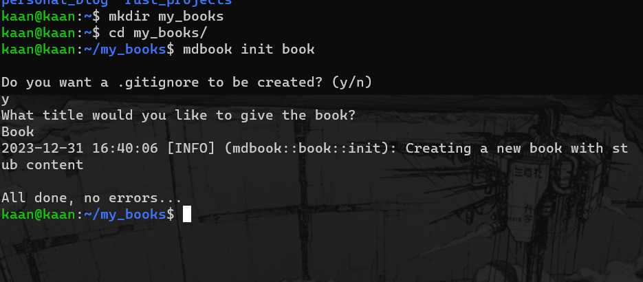
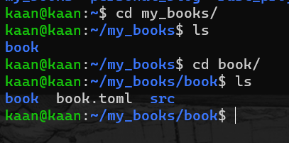
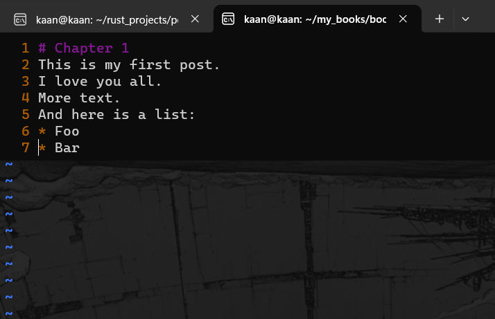
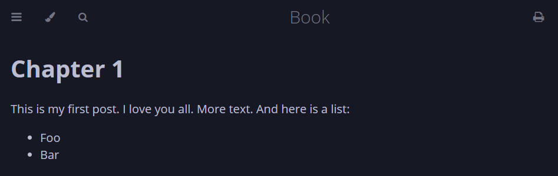
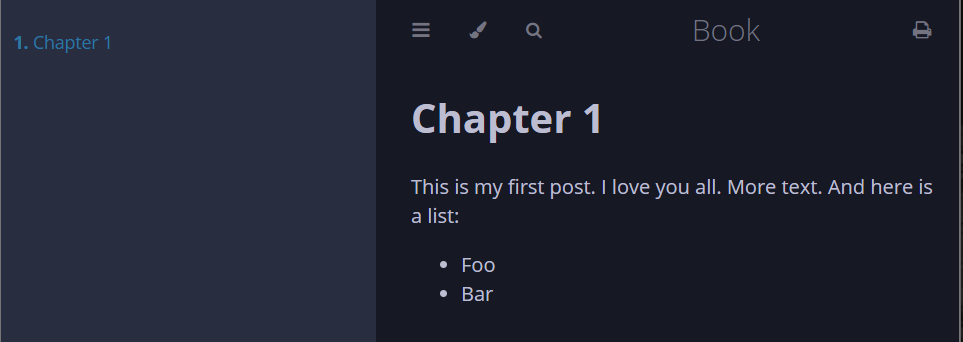

# Welcome
Hi my name is Kaan Akgündoğdu, I'm a Software Engineer and I love learning new programming langages. I am familiar with Rust, C++,C and Javascript.
I've been developing in Rust for about a year, and I've been planning to write my own blog in Rust for a long time. And here you have a blog page created with mdBook. This is a personal blog and it will contain technical posts as well as manga and game reviews. At least I hope so. 

As my first blog post, I would like to explain how I created this page. We won't get into writing Rust code much, but I'm sure it will be an instructive post.

#### *Opening Song*
<iframe width="457" height="314" src="https://www.youtube.com/embed/dDqnBZ0k_ZE" title="JoJo&#39;s Bizarre Adventure Opening 6 Full Song『CHASE』" frameborder="0" allow="accelerometer; autoplay; clipboard-write; encrypted-media; gyroscope; picture-in-picture; web-share" allowfullscreen></iframe>

First if you don't installed rust you need to install it. Follow this link and install rust at least version 1.70 [Install Rust](https://www.rust-lang.org/tools/install). After that the following command can be used to build and install mdBook:
```
cargo install mdbook
```

Once you have the mdbook CLI tool installed, you can use it to create and render a book.
```
mdbook init book
```
I created a new directory and run the command there. It will ask some questions you can answer whatever you like but i did like this.



After answering the questions, you can change the current directory into the new book. Here is our folders and files.



In src folder we have 2 files. SUMMARY.md is a file contains a list of all the chapters in the book. Before a chapter can be viewed, it must be added to this list.

```
# Summary

- [Chapter 1](./chapter_1.md)
```

The content of your book is all contained in the src directory. Each chapter is a separate Markdown file. In this example it is our first chapter.
Open chapter_1.md and change it as you like I made mine is like this:



Our book is ready run this command and to see your book in the browser.

```
mdbook build --open
```

Congratulations, your page should look like this.



And if you click 3 lines on the top left (listing sidebar) you will see your page like this:




This post was a very simple example. I don't want to dive too deep. But you can do what markdown offers in this book. Like adding link, pictures, lists and so on. This is it our page is ready and you can make your own blog page or book with mdBook. Thanks for reading this far. If you want you can follow me on Github or send connection on LinkedIn. 

Here are my links:

>- [Github](https://github.com/kaanakgundogdu)
>- [LinkedIn](https://www.linkedin.com/in/kaanakgundogdu/)

#### **Ending Song**
<iframe width="457" height="314" src="https://www.youtube.com/embed/oSMDucSCfu0" title="FAITH" frameborder="0" allow="accelerometer; autoplay; clipboard-write; encrypted-media; gyroscope; picture-in-picture; web-share" allowfullscreen></iframe>

## Resources:
>- [mdBook](https://rust-lang.github.io/mdBook/index.html)
